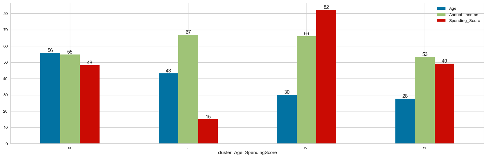
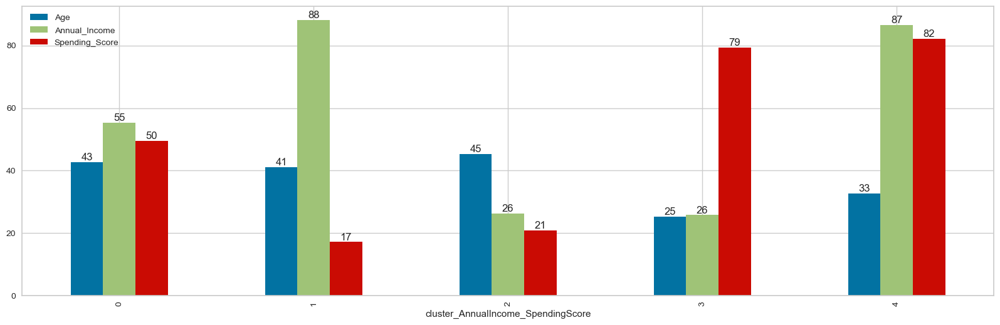

# Customer-Segmentation

In this project, customers are required to be segmented according to the purchasing history obtained from the membership cards of a big mall.

This project is less challenging than other projects. After getting to know the data set quickly, you are expected to perform Exploratory Data Analysis. You should observe the distribution of customers according to different variables, also discover relationships and correlations between variables. Then you will spesify the different variables to use for cluster analysis.

The last step in customer segmentation is to group the customers into distinct clusters based on their characteristics and behaviors. One of the most common methods for clustering is K-Means Clustering, which partitions the data into k clusters based on the distance to the cluster centroids. Other clustering methods include hierarchical clustering, density-based clustering, and spectral clustering. Each cluster can be assigned a label that describes its main features and preferences.

# Tasks: ⚙️

#### 1. Import Libraries, Load Dataset, Exploring Data
- Import Libraries
- Load Dataset
- Explore Data

#### 2. Exploratory Data Analysis (EDA)

#### 3. Cluster Analysis

- Clustering based on Age and Spending Score

    *i. Create a new dataset with two variables of your choice*
    
    *ii. Determine optimal number of clusters*
    
    *iii. Apply K Means*
    
    *iv. Visualizing and Labeling All the Clusters*
    
    
- Clustering based on Annual Income and Spending Score

    *i. Create a new dataset with two variables of your choice*
    
    *ii. Determine optimal number of clusters*
    
    *iii. Apply K Means*
    
    *iv. Visualizing and Labeling All the Clusters*
    
    
- Hierarchical Clustering

    *i. Determine optimal number of clusters using Dendogram*

    *ii. Apply Agglomerative Clustering*

    *iii. Visualizing and Labeling All the Clusters*

- Conclusion

## Used Libraries 📚
- `numpy`- `pandas`- `matplotlib`- `seaborn` - `sklearn`- `yellowbrick` - `scipy`

  
## Run the project ⚙️
The repository includes a Jupyter notebook which you can run on your local machine or use this  link.

## Results 🪄

### Conclusion of Clustering based on Age and Spending Score
<b>cluster 0</b> : The average age is around 56, both annula_income and spending_scores are on average.
It should be researched what can be done to direct to more spending.

<b>cluster 1</b>: The average age is around 43, the annula_income is high but the spending_scores are very low.
This group is our target audience and specific strategies should be developed to drive this group to spend.

<b>cluster 2</b>:The average age is around 30. The annula_income is high and spending_scores are very high.
This group consists of our loyal customers. Our company derives the main profit from this group. Very
special promotions can be made in order not to miss it.    
    
<b>cluster 3</b>: The average age is around 28.both annula_income and spending_scores are on average.
It should be researched what can be done to direct to more spending.

### Conclusion of Clustering based on Annual Income and Spending Score
<b>cluster 0</b> : The average age is around 43, both annula_income and spending_scores are on average.
It should be researched what can be done to direct more spending.

<b>cluster 1</b>: The average age is around 41, their annual income is very high but their spending_score
is very low. This group is our target audience and special strategies need to be developed for this
group.

<b>cluster 2</b> :The average age is around 45. Both annula_income and spending_scores are low. It can be
directed to shopping with gift certificates.

<b>cluster 3</b>: The average age is around 25. Low annual_incomes but very high spending scores. This
group does a lot of shopping, but they do not bring much profit.

<b>cluster 4</b>: The average age is around 33, both annula_income and spending_scores are very high.
This group consists of our loyal customers. Our company derives the main profit from this group. Very
special promotions can be made in order not to miss it. 

## Acknowledgements
This project is part of ML bootcamp provided by <a href="https://clarusway.com/"> Clarusway</a>.

  
